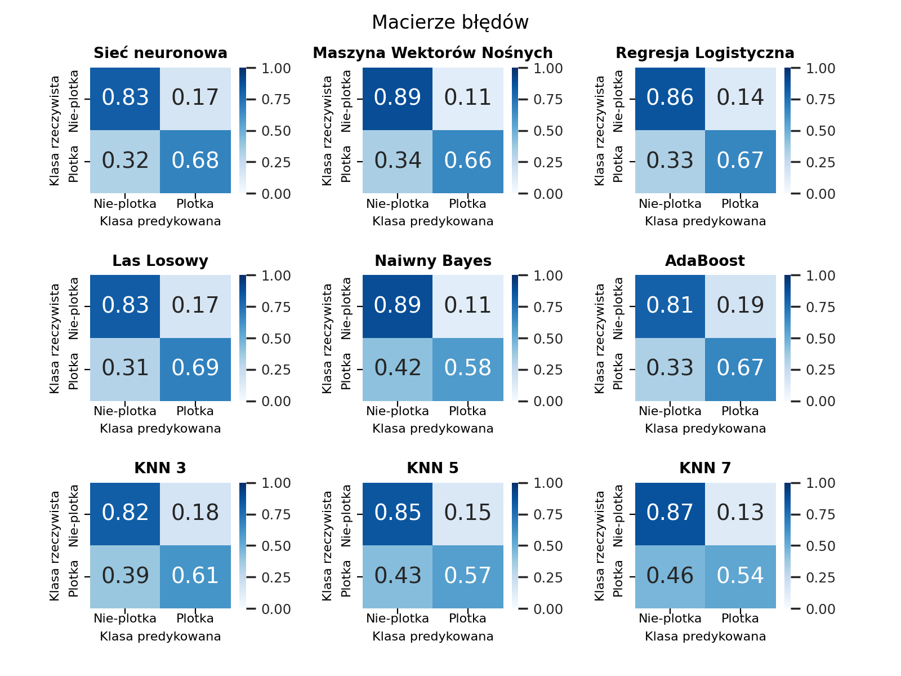
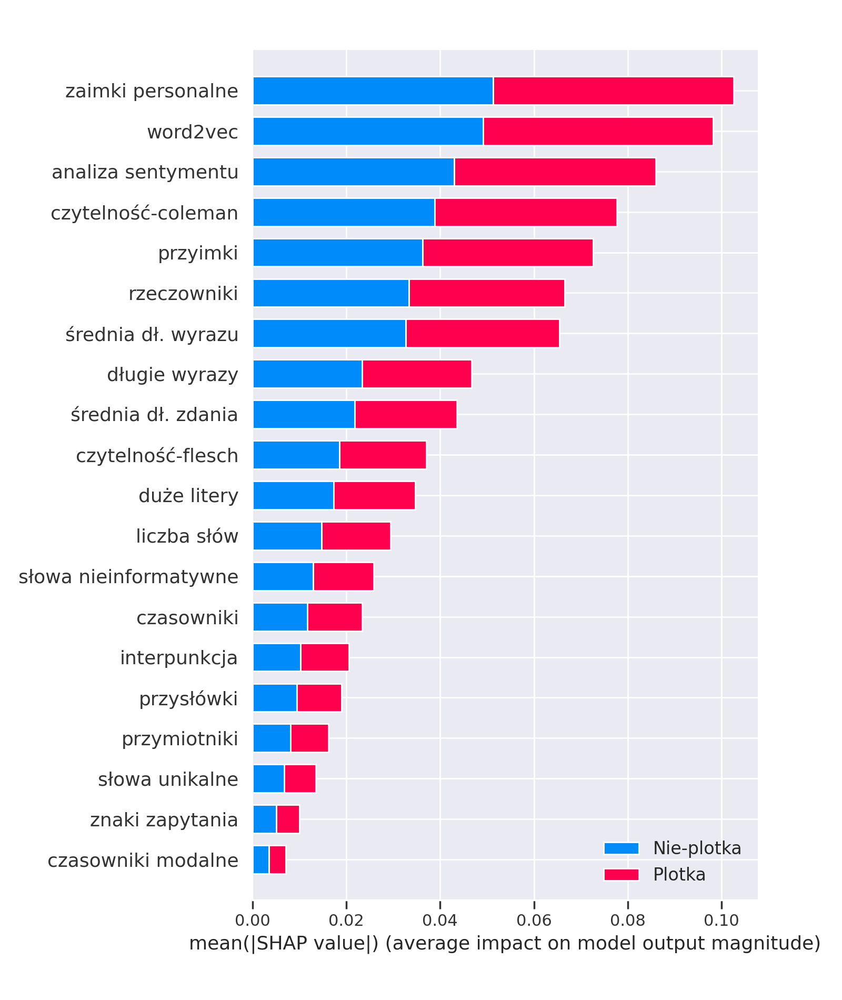

# Fake news detection on social platforms

This is a project demonstrating accuracy of selected machine learning classification algorithms (NN, SVM, LR, RF, NB, AdaBoost, KNN) combined with word embeddings (BOW, W2V and a custom set of features) in a task of deciding whether a comment/post is a fake news or not. The only information that's being taken into account is the text of a comment - that allows a system to be used on any platform. The accuracy results are an average of 10-fold cross-validation.

## Results

While the Support Vector Machine turned out to be the best classifier in this competition, the Random Forest classifier was the best when it came to detecting misinformation, as it achieved the lowest error on confussion matrices (0.31 on the example figure). When it comes to misinformation it is important to have the lowest amount of fake news getting detected as a non-threatening messages, as the damage caused by these can be significant.

| Dataset | Word Embeddings        | NN                         | **SVM**                             | LR                         | RF                         | NB                         | AdaBoost                   | KNN 3                      | KNN 5                      | KNN 7                      |
| ------- | ---------------------- | -------------------------- | ----------------------------------- | -------------------------- | -------------------------- | -------------------------- | -------------------------- | -------------------------- | -------------------------- | -------------------------- |
| KAGGLE  | BOW                    | $75.6\%$   ($\pm1.2$) | $\textbf{79.1\%}$   ($\pm1.3$) | $77.9\%$($\pm1.2$)         | $77.0\%$   ($\pm1.5$) | $75.7\%$   ($\pm1.1$) | $74.9\%$   ($\pm1.0$) | $73.2\%$   ($\pm1.5$) | $73.0\%$   ($\pm2.1$) | $72.9\%$   ($\pm1.8$) |
|         | Word2Vec               | $74.0\%$   ($\pm1.6$) | $78.0\%$   ($\pm1.0$)          | $76.4\%$   ($\pm1.0$) | $77.7\%$   ($\pm1.3$) | $74.4\%$   ($\pm1.3$) | $75.0\%$   ($\pm0.8$) | $74.3\%$   ($\pm1.6$) | $76.1\%$   ($\pm1.7$) | $76.7\%$   ($\pm1.3$) |
|         | Custom set of features | $69.6\%$   ($\pm2.6$) | $71.4\%$   ($\pm1.9$)          | $70.7\%$   ($\pm1.9$) | $73.5\%$   ($\pm1.5$) | $64.4\%$   ($\pm1.5$) | $70.3\%$   ($\pm1.6$) | $67.7\%$   ($\pm2.4$) | $68.4\%$   ($\pm2.5$) | $69.3\%$   ($\pm1.9$) |
| PHEME1  | BOW                    | $84.2\%$   ($\pm1.6$) | $\textbf{85.7\%}$   ($\pm1.1$) | $83.8\%$   ($\pm1.5$) | $84.4\%$   ($\pm1.4$) | $78.8\%$   ($\pm2.0$) | $82.1\%$   ($\pm2.1$) | $81.1\%$   ($\pm1.5$) | $79.7\%$   ($\pm1.2$) | $79.6\%$   ($\pm2.1$) |
|         | Word2Vec               | $77.8\%$   ($\pm1.6$) | $77.8\%$   ($\pm1.0$)          | $74.1\%$   ($\pm1.6$) | $77.0\%$   ($\pm1.7$) | $69.6\%$   ($\pm1.3$) | $73.3\%$   ($\pm1.8$) | $77.8\%$   ($\pm1.5$) | $77.6\%$   ($\pm1.5$) | $78.7\%$   ($\pm0.8$) |
|         | Custom set of features | $69.6\%$   ($\pm1.7$) | $69.0\%$   ($\pm2.4$)          | $68.7\%$   ($\pm2.3$) | $71.9\%$   ($\pm2.1$) | $64.9\%$   ($\pm2.1$) | $68.7\%$   ($\pm1.9$) | $65.3\%$   ($\pm1.6$) | $65.7\%$   ($\pm1.4$) | $66.4\%$   ($\pm1.8$) |
| PHEME2  | BOW                    | $84.3\%$   ($\pm1.8$) | $\textbf{86.1\%}$   ($\pm1.3$) | $84.2\%$   ($\pm1.2$) | $85.0\%$   ($\pm1.8$) | $74.7\%$   ($\pm2.3$) | $81.6\%$   ($\pm1.9$) | $81.5\%$   ($\pm2.1$) | $79.8\%$   ($\pm2.3$) | $79.7\%$   ($\pm3.2$) |
|         | Word2Vec               | $79.5\%$   ($\pm1.1$) | $79.8\%$   ($\pm1.2$)          | $76.5\%$   ($\pm1.1$) | $79.1\%$   ($\pm1.1$) | $73.4\%$   ($\pm1.7$) | $75.8\%$   ($\pm2.4$) | $79.7\%$   ($\pm1.5$) | $80.4\%$   ($\pm1.2$) | $80.3\%$   ($\pm1.0$) |
|         | Custom set of features | $72.6\%$   ($\pm1.7$) | $71.6\%$   ($\pm1.3$)          | $71.2\%$   ($\pm1.3$) | $73.9\%$   ($\pm1.9$) | $60.7\%$   ($\pm2.2$) | $70.5\%$   ($\pm2.4$) | $67.6\%$   ($\pm1.2$) | $68.5\%$   ($\pm1.4$) | $68.9\%$   ($\pm1.6$) |

## Software required

- Python
- Anaconda (optional)

## Libraries

- pandas~=1.2.1
- numpy~=1.18.5
- tensorflow~=2.3.0
- nltk~=3.5
- scikit-learn~=0.24.1
- keras~=2.4.0
- gensim~=3.8.3
- seaborn~=0.11.1
- matplotlib~=3.4.2
- textstat~=0.7.1
- shap~=0.39.0

## Datasets

- https://www.kaggle.com/hamditarek/fake-news-detection-on-twitter-eda/data
- https://www.zubiaga.org/datasets/ ("PHEME dataset for Rumour Detection and Veracity Classification" and "PHEME rumour dataset")

## Run instructions

- Install required libraries with a command `pip install -r requirements.txt`
- Download datasets with a `.csv` format containing two columns: `text` (representing a comment/post) and `target` (value 0 or 1, where 0 means that a comment is not a misinformation, and 1 means that it is)
- For datasets available on https://www.zubiaga.org/datasets/ it is necessary to convert `.json` files to a '.csv' format, which can be done with a script `convert.py`. Example of running this script: `python convert.py path/to/folder/containing/json/files result.csv`
- Running programs `bow.py` (uses a Bag of Words), `customised.py` (uses a custom set of linguistic features) or `w2v.py` (uses a Word2Vec representation). For example, running the tests for a BOW representation: `python bow.py data.csv 0_or_1`, where the value at the end means generating martices of confusion and a linguistic features evaluation (the latter only for a custom set of features defined in `customised.py`)

## Sample of generated figures (in Polish)

Confusion matrices (Bag of Words and first dataset)

The most important features (first dataset)
